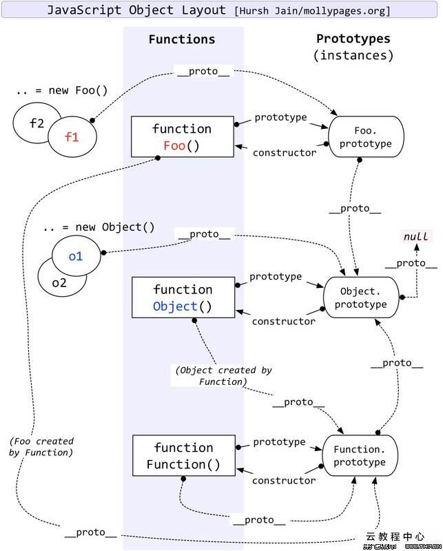

模拟new操作符需要了解一下几点

1、JS的世界中构造函数可以有返回值，但只有返回值是引用类型时，才会返回该返回值，而基本类型（string,number,boolean,null,undefined）或者无返回值时则返回该实例化对象

2、实例化对象与构造函数之间的关系 -- 原型关系

3、所谓模拟也只是利用apply将函数内部的this指向了构造函数原型，这样基于构造函数的实例化对象就可以通过__proto__访问构造函数内部this对象上的属性



```js
function newOperator(ctor) {
    if (!ctor instanceof Function) throw 'newOperator must accept a function params';

    function createThisEvit() {
        return Object.create(ctor.prototype);
    }

    function bindThisForCtor(bindingThis, args) {
        return ctor.apply(bindingThis, args);
    }

    function ruleOutBasicDataType(data) {
        return (data !== null && typeof data === 'object') || typeof data === 'function';
    }

    return function(...args) {
        const bindingThis = createThisEvit();
        const ctorReturn = bindThisForCtor(bindingThis, args);

        if (ruleOutBasicDataType(ctorReturn)) {
            return ctorReturn;
        }
        return bindingThis;
    }
}


function Student(name, sex) {
    this.name = name;
    this.sex = sex;
}

const student = newOperator(Student)('xiaoming', 'girl');

console.log(student) // Student { name: 'xiaoming', sex: 'girl' }

function School(name, city) {
    this.name = name;
    this.city = city;
    return student;
}

const school = newOperator(School)('chengduligongdaxue', 'chengdu');

console.log(school) // Student { name: 'xiaoming', sex: 'girl' }
```